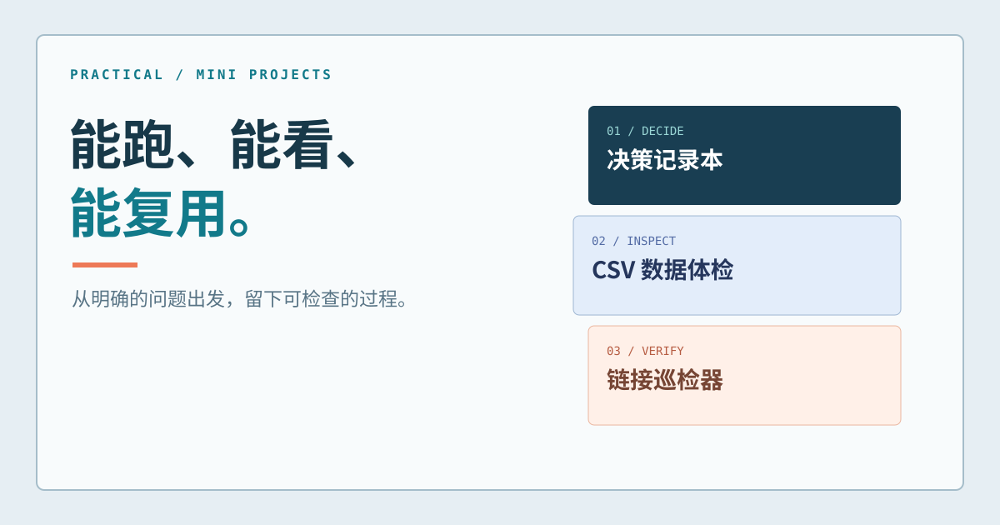

# Practical Mini Projects｜三个可复制的小项目




**选择方案、检查数据、巡检链接。** 每个项目对应一个具体场景，包含运行方法、示例输入、自动测试与设计取舍。

> 📦 [下载完整源码（ZIP）](practical-mini-projects.zip)｜解压后可分别复制 `projects/` 下的三个目录。仓库页面目前提供项目总览，完整目录、封面、截图和测试都在 ZIP 中。

**在线查看核心源码**：[决策规则](decision.mjs) · [CSV 解析与校验](csv.mjs) · [链接巡检 CLI](link_auditor.py)。完整网页、样本、测试与逐项目 README 请下载上方 ZIP。


## 项目一：Decision Notebook｜决策记录本

**场景**：只有两周时间做求职作品，需要比较不同方案。输入候选方案的证据与权重，查看推荐结果；依据不足时允许暂缓结论。

- **展示能力**：把模糊选择转成可解释的判断规则；展示权重变化与结论的关系。
- **技术**：原生 HTML / CSS / JavaScript；Node.js 测试，无运行时依赖。
- **运行**：解压后进入 `projects/decision-notebook`，执行 `python -m http.server 8000`，打开 `http://localhost:8000`；执行 `npm test` 验证规则。
- **边界**：评分是演示规则，不等于真实招聘结果。设计取舍写在 `docs/DECISIONS.md`。

## 项目二：CSV Lens｜订单数据体检

**场景**：订单 CSV 交给分析师前，先找到缺失值、重复订单号和格式异常的记录，并导出问题清单。

- **展示能力**：解析带引号的 CSV、定位行号、处理重复键与缺失值、导出可复核报告。
- **技术**：原生 HTML / CSS / JavaScript；Node.js 测试，无运行时依赖。
- **运行**：进入 `projects/csv-quality-check`，执行 `python -m http.server 8001`，打开 `http://localhost:8001`；执行 `npm test`。
- **边界**：只在浏览器本地处理 UTF-8 CSV，适合小文件，不代替专业数据管道。

## 项目三：Link Auditor｜链接巡检

**场景**：帮助中心搬迁后，批量检查关键链接是否正常、重定向或失效。

- **展示能力**：命令行参数设计、请求超时处理、`HEAD` 失败时回退 `GET`、CSV 报告与离线测试。
- **技术**：Python 标准库，无第三方依赖。
- **运行**：进入 `projects/link-auditor`，执行 `python demo.py` 查看本机离线演示；执行 `python -m unittest discover -s tests -v` 跑测试。
- **边界**：网站可能限制自动请求；状态码只能反映检查时刻。

## 项目结构与验证

```text
projects/decision-notebook/   决策网页、设计记录、5 个测试
projects/csv-quality-check/   CSV 工具、合成订单样本、5 个测试
projects/link-auditor/       Python CLI、本机演示、4 个测试
assets/                      仓库封面
.github/workflows/           测试工作流
```

本地验证：Decision Notebook **5/5**、CSV Lens **5/5**、Link Auditor **4/4**。示例中的求职情境、订单与网站均为**模拟材料**，不能写成真实业务业绩。

## 如何写进简历

先运行项目，选择与目标岗位最相关的一个，亲自改动场景或功能，并留下真实记录。可以按“遇到的问题 → 亲自实现的功能 → 如何验证 → 取舍与局限”来介绍。不要把模拟数据写成工作成果。

MIT License 见完整源码包。
